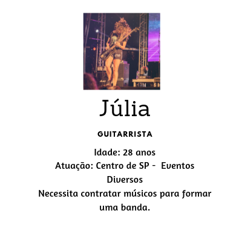
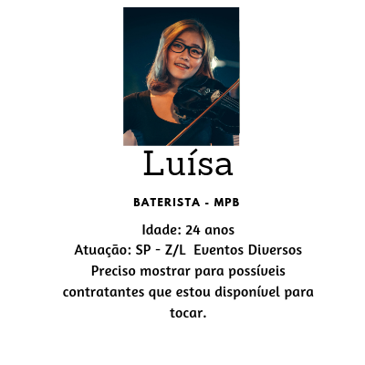

# Music Hub

Squad: 
*Ana Carolina Biscalchin*  
*Bruna Gabriele de Paula*  
*Jéssica Ferreira da Silva*  
*Letícia Oliveira*  
*Marina Keunecke*  
*Yara Guimarães de Oliveira*  

[Link da aplicação](https://ana-biscalchin.github.io/music-hub/)

Projeto desenvolvido no curso de Desenvolvedoras Front-End para o Bootcamp **Laboratória** - campus SP - Brasil.

## Índice

* [Organização](#Organização)
* [Checklist](#Checklist)
* [Personas](#Personas-Lean-UX)
* [Definição do produto](#Definição-do-produto)
* [UX](#UX)
* [Pesquisa](#Pesquisa)
* [Protótipo](#Protótipo)
* [Testes de usabilidade](#Testes-de-usabilidade)
* [Roadmap](#Roadmap)

## Organização

Utilizamos a ferramenta **Trello**.

Dividimos o projeto em mini partes e as mesmas foram divididas entre as integrantes. 
Foram priorizadas utilizando 2 critérios principais: o que era necessário para desenvolver o _MVP_ do site e o que era "requisito obrigatório" no projeto, neste caso, consumir uma API REST.  
[Music Hub](https://trello.com/b/X9juFZRZ/music-hub)  

## Checklist

* [X] Definir um projeto que solucione um problema no setor de entreternimento e utilize uma _API REST_.
* [X] Inclui esboço da solução (protótipo de baixa fidelidade e de alta fidelidade, se houver) no
  `README.md`.
* [X] Criar um formulário de pesquisa e encaminhar para o público alvo, publicar o resultado no `README.md`.
* [X] Fazer _mapa de afinidades_.
* [X] Inclui a lista de problema detectados através dos testes de usabilidade
  no `README.md`.
* [X] Inclui _Definição de produto_ clara e informativa no `README.md`.
* [X] Utilizar API REST.
* [X] Utilizar Eslint para guia de estilo.
* [X] Teste do código: Utilizar Mocha + Chai ou Wallaby.
* [X] UX: Design Sprint (Problema, Solução/Ideia, Análise da Concorrência, Prototipação e Testes com Usuários)
_
## Personas Lean UX

## Definição do produto

**Music Hub** é um site para contratantes encontrarem músicos. Onde possibilitará buscas por gênero musical e agenda do músico.
O objetivo da aplicação é ser construído em "mobile first" e oferecer uma interface intuitiva que proporcione ao usuário uma ferramenta de consulta e que possa encontrar e contratar músicos para o seu evento.  
`API utilizada:`
[Cronofy](https://www.cronofy.com/)  
`Definição do Produto: Business Model Canvas:`  
[Business Model Canvas](https://docs.google.com/spreadsheets/d/1PPFSmGrrzhP1jlaPla6tXW9oSxoant3-hqQvmxgSu0U/edit?usp=sharing)  

## UX

Tentamos compreender os principais problemas relacionados a contratação de músicos para um determinado evento e a partir disso, entedemos quem eram nossos _steakholders_ e o que eles necessitavam.
Dentro do prazo fornecido, iniciamos o processo, levando em conta as limitações técnicas.
- Informações sobre o problema atual.
- Análise de concorrência.
- Personas de usuários.
- Mapa de afinidades.
- Metodologias para mapear problemas e soluções.
- Definição do nome do site utilizando `Brainstorm`.
- Definição do layout utilizando `Crazy Eights`.
- Heurística.

[Mapa de afinidades:](asserts/docs/mapa_de_afinidades.jpg)  

## Pesquisa

-Músicos.  
-Contratantes reais.  
-Concorrência (sites que oferecem serviços semelhantes).  
[Pesquisa com contratantes](https://bruna256.typeform.com/report/URGIgy/9czVW1cIEixmj4Ql)
[Pesquisa com músicos](https://bruna256.typeform.com/report/C9TmG1/D7pxTojVxShHGHho)

## Protótipo
[Link do 1º Protótipo - Marvel](https://marvelapp.com/515cb20/screen/56895668) 

## Testes de Usabilidade
Problemas detectados no teste de usabilidade:
* Home não "apresentava" o site e qual era a proposta dele de maneira clara.
* XX?.

## Roadmap

* Músicos disponíveis no momento
* Incluir músicos infantis
* Modo noturno
* Página do músico: minha agenda, meus contatos, meu portfolio e mensagens
* Avaliação dos músicos
* Georreferenciamento
* Login único, onde o músico possa oferecer seu trabalho, bem como procurar um músico também (ex: precisa de um baixista para a banda dele).
* Incluir versão premium paga. Onde os resultados dos músicos ficam em primeiro lugar.

<!-- # Music Hub

  

**Site responsivo (web mobile) com plataforma para unir músicos e contratantes **

Projeto do Bootcamp da [Laboratória](http://laboratoria.la/), no qual realizamos toda as etapas da concepção do produto.

Etapas de UX (User Experience):
-
-

A versão atual contém as seguintes funcionalidades: 

   
Protótipo feito no app [Marvel](https://marvelapp.com/515cb20)

  

## Como utilizar:

  

## roadmap oficial do projeto

  

#### versão 2.0.0 (sem previsão, aceita-se contribuições)

- README translated to english;

#### versão 1.0.0 (released)

- funcionalidades:

	- Cadastro e Login de usuários; 
	- 
	-   -->

